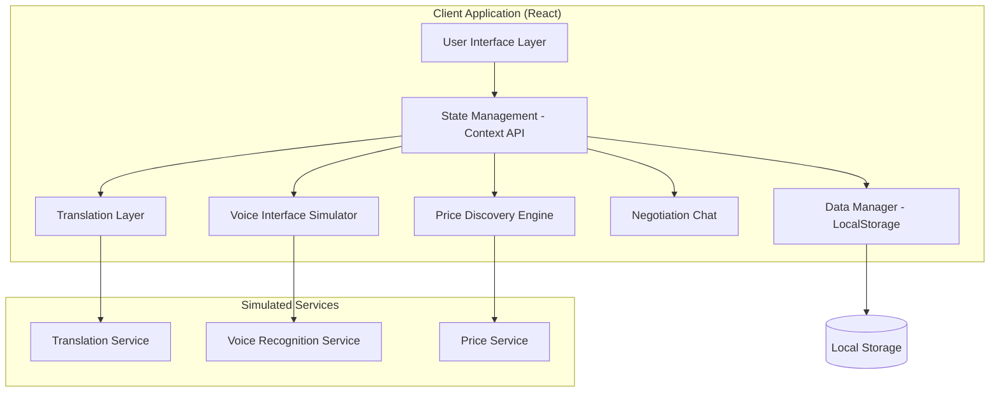

# Design Document: Multilingual Mandi

## Overview

Multilingual Mandi is a React-based web application that bridges language barriers in local Indian produce markets. The system provides voice-first interfaces for vendors, real-time translation capabilities, AI-powered price discovery, and negotiation tools. The application simulates AI translation and voice recognition features using client-side JavaScript, making it deployable as a static web application.

The design emphasizes accessibility, mobile-first responsive design, and cultural appropriateness through the Viksit Bharat theme. All AI features are simulated to provide realistic user experiences without requiring external AI services.

## Architecture

### System Architecture



### Component Architecture

The application follows a component-based architecture with clear separation of concerns:

- **Presentation Layer**: React components with Tailwind CSS styling
- **Business Logic Layer**: Custom hooks and service modules
- **Data Layer**: LocalStorage with structured data models
- **Simulation Layer**: Mock services for AI features

## Components and Interfaces

### Core Components

#### VendorInterface Component
```typescript
interface VendorInterfaceProps {
  onListingCreate: (listing: Listing) => void;
  currentLanguage: SupportedLanguage;
}

interface VoiceRecordingState {
  isRecording: boolean;
  recordedText: string;
  isProcessing: boolean;
  language: SupportedLanguage;
}
```

#### BuyerFeed Component
```typescript
interface BuyerFeedProps {
  listings: Listing[];
  onSearch: (query: string) => void;
  onListingSelect: (listing: Listing) => void;
  targetLanguage: SupportedLanguage;
}

interface SearchState {
  query: string;
  filters: ProduceFilter[];
  sortBy: SortOption;
}
```

#### PriceDiscoveryWidget Component
```typescript
interface PriceDiscoveryProps {
  selectedProduce?: ProduceType;
  onProduceSelect: (produce: ProduceType) => void;
}

interface MarketPrice {
  produce: ProduceType;
  high: number;
  low: number;
  average: number;
  unit: string;
  lastUpdated: Date;
}
```

#### NegotiationChat Component
```typescript
interface NegotiationChatProps {
  buyerId: string;
  vendorId: string;
  listingId: string;
  onMessageSend: (message: ChatMessage) => void;
}

interface ChatMessage {
  id: string;
  senderId: string;
  originalText: string;
  translatedText: string;
  originalLanguage: SupportedLanguage;
  targetLanguage: SupportedLanguage;
  timestamp: Date;
  isTranslating: boolean;
}
```

### Service Interfaces

#### Translation Service
```typescript
interface TranslationService {
  translate(text: string, from: SupportedLanguage, to: SupportedLanguage): Promise<TranslationResult>;
  detectLanguage(text: string): Promise<SupportedLanguage>;
  getSupportedLanguages(): SupportedLanguage[];
}

interface TranslationResult {
  translatedText: string;
  confidence: number;
  originalLanguage: SupportedLanguage;
  targetLanguage: SupportedLanguage;
}
```

#### Voice Recognition Service
```typescript
interface VoiceRecognitionService {
  startRecording(language: SupportedLanguage): Promise<void>;
  stopRecording(): Promise<VoiceRecognitionResult>;
  isSupported(): boolean;
}

interface VoiceRecognitionResult {
  text: string;
  confidence: number;
  language: SupportedLanguage;
  duration: number;
}
```

#### Price Discovery Service
```typescript
interface PriceDiscoveryService {
  getCurrentPrices(produce: ProduceType[]): Promise<MarketPrice[]>;
  getPriceHistory(produce: ProduceType, days: number): Promise<PriceHistoryPoint[]>;
  suggestPrice(produce: ProduceType, quality: QualityGrade): Promise<PriceSuggestion>;
}
```

## Data Models

### Core Data Models

```typescript
type SupportedLanguage = 'hindi' | 'tamil' | 'english';
type ProduceType = 'onions' | 'tomatoes' | 'potatoes' | 'rice' | 'wheat' | 'carrots';
type QualityGrade = 'premium' | 'standard' | 'economy';
type ListingStatus = 'active' | 'sold' | 'unavailable';

interface User {
  id: string;
  name: string;
  type: 'vendor' | 'buyer';
  preferredLanguage: SupportedLanguage;
  location: string;
  phoneNumber?: string;
  createdAt: Date;
}

interface Listing {
  id: string;
  vendorId: string;
  produce: ProduceType;
  originalDescription: string;
  translatedDescriptions: Record<SupportedLanguage, string>;
  originalLanguage: SupportedLanguage;
  price: number;
  unit: string;
  quantity: number;
  quality: QualityGrade;
  status: ListingStatus;
  images?: string[];
  location: string;
  createdAt: Date;
  updatedAt: Date;
}

interface ChatSession {
  id: string;
  buyerId: string;
  vendorId: string;
  listingId: string;
  messages: ChatMessage[];
  status: 'active' | 'closed';
  createdAt: Date;
  lastActivity: Date;
}
```

### Application State Model

```typescript
interface AppState {
  currentUser: User | null;
  listings: Listing[];
  chatSessions: ChatSession[];
  marketPrices: MarketPrice[];
  uiState: {
    currentView: 'vendor' | 'buyer' | 'chat';
    selectedListing: string | null;
    activeChatSession: string | null;
    isVoiceRecording: boolean;
    searchQuery: string;
    filters: ProduceFilter[];
  };
  settings: {
    theme: 'light' | 'dark';
    language: SupportedLanguage;
    notifications: boolean;
  };
}
```

## Correctness Properties

*A property is a characteristic or behavior that should hold true across all valid executions of a system—essentially, a formal statement about what the system should do. Properties serve as the bridge between human-readable specifications and machine-verifiable correctness guarantees.*

Before defining the correctness properties, let me analyze the acceptance criteria to determine which ones are testable:

<function_calls>
<invoke name="prework">
<parameter name="featureName">multilingual-mandi

Based on the prework analysis, here are the consolidated correctness properties:

### Property 1: Voice Interface Workflow Integrity
*For any* voice recording session, starting recording should display indicators, completing recording should produce text in the specified language, and confirming the text should create a listing with that content.
**Validates: Requirements 1.1, 1.2, 1.3, 1.5**

### Property 2: Translation Bidirectionality
*For any* text in Hindi, Tamil, or English, translating to another supported language and back should preserve the essential meaning and support round-trip consistency.
**Validates: Requirements 2.5**

### Property 3: Automatic Translation Trigger
*For any* listing created in a local language, the system should automatically generate translations in all other supported languages without manual intervention.
**Validates: Requirements 2.1, 6.3**

### Property 4: Translation Display Completeness
*For any* translated content displayed to users, both the original text and translated version should be visible with accuracy indicators.
**Validates: Requirements 2.2, 2.3, 4.3**

### Property 5: Translation Error Handling
*For any* translation that fails, the system should display the original text with an appropriate error message rather than showing incomplete or corrupted content.
**Validates: Requirements 2.4**

### Property 6: Price Discovery Data Integrity
*For any* produce type supported by the system, the price discovery widget should display current market rates with high, low, and average values.
**Validates: Requirements 3.1, 3.2**

### Property 7: Price Comparison Accuracy
*For any* vendor listing with a price, the system should accurately compare it against current market rates and provide meaningful comparison indicators.
**Validates: Requirements 3.5**

### Property 8: Chat Session Management
*For any* buyer-vendor interaction, initiating chat should create a unique session that maintains message history with all translations preserved.
**Validates: Requirements 4.1, 4.5**

### Property 9: Real-time Chat Translation
*For any* message sent in a chat session, it should be automatically translated to the recipient's preferred language and display both versions.
**Validates: Requirements 4.2, 4.3**

### Property 10: Responsive Design Consistency
*For any* screen size or orientation, the interface should maintain touch-friendly button sizes and prioritize essential functions in the primary view.
**Validates: Requirements 5.1, 5.2, 5.5**

### Property 11: Visual Accessibility Standards
*For any* UI element, the color contrast should meet accessibility standards for bright sunlight readability while following the Viksit Bharat theme.
**Validates: Requirements 5.3, 5.4**

### Property 12: Listing Management Completeness
*For any* listing operation (create, update, delete, status change), the system should store complete metadata including timestamps and automatically handle translation updates.
**Validates: Requirements 6.1, 6.2, 6.3, 6.4, 6.5**

### Property 13: Search Functionality Comprehensiveness
*For any* search query, the system should search across both original and translated text, filter results appropriately, and provide helpful suggestions when no results are found.
**Validates: Requirements 7.2, 7.3, 7.4**

### Property 14: Feed Display and Sorting
*For any* set of active listings, the buyer feed should display them in a scrollable interface with multiple sorting options (relevance, price, recency).
**Validates: Requirements 7.1, 7.5**

### Property 15: Data Persistence Round-trip
*For any* user data (listings, chat messages, settings), storing to local storage and retrieving should preserve all information accurately across browser sessions.
**Validates: Requirements 8.1, 8.2**

### Property 16: Data Management Robustness
*For any* data storage scenario including full storage or schema changes, the system should handle cleanup and migration without data loss.
**Validates: Requirements 8.3, 8.4, 8.5**

## Error Handling

### Translation Service Error Handling
- **Network Simulation Failures**: When simulated translation services are unavailable, display original text with retry options
- **Language Detection Errors**: Fallback to user's preferred language when automatic detection fails
- **Partial Translation Failures**: Show partially translated content with clear indicators of incomplete sections

### Voice Recognition Error Handling
- **Microphone Access Simulation**: Provide clear feedback when voice recording simulation cannot start
- **Audio Processing Errors**: Display helpful error messages and alternative input methods
- **Language Mismatch**: Alert users when detected language doesn't match selected language

### Data Persistence Error Handling
- **Storage Quota Exceeded**: Implement automatic cleanup of old data with user notification
- **Corrupted Data Recovery**: Validate data integrity on load and provide recovery options
- **Migration Failures**: Maintain backward compatibility and graceful degradation

### UI Error Handling
- **Component Load Failures**: Show skeleton screens and retry mechanisms
- **Network Connectivity**: Provide offline mode indicators and cached data access
- **Browser Compatibility**: Graceful degradation for unsupported features

## Testing Strategy

### Dual Testing Approach

The testing strategy employs both unit testing and property-based testing to ensure comprehensive coverage:

**Unit Testing Focus:**
- Specific user interaction scenarios and edge cases
- Component integration points and data flow validation
- Error condition handling and recovery mechanisms
- UI component rendering and state management

**Property-Based Testing Focus:**
- Universal properties that must hold across all inputs
- Translation accuracy and consistency validation
- Data persistence and retrieval integrity
- UI responsiveness across different screen sizes and orientations

### Property-Based Testing Configuration

**Testing Framework**: Use `fast-check` library for property-based testing in JavaScript/TypeScript
**Test Configuration**: Minimum 100 iterations per property test to ensure comprehensive input coverage
**Test Tagging**: Each property test must reference its corresponding design document property

**Example Test Tags:**
- **Feature: multilingual-mandi, Property 1: Voice Interface Workflow Integrity**
- **Feature: multilingual-mandi, Property 2: Translation Bidirectionality**
- **Feature: multilingual-mandi, Property 15: Data Persistence Round-trip**

### Testing Implementation Strategy

**Component Testing:**
- Test React components in isolation using React Testing Library
- Mock external dependencies and focus on component behavior
- Validate accessibility features and responsive design

**Integration Testing:**
- Test complete user workflows from voice input to listing creation
- Validate translation pipeline from input to display
- Test chat functionality with simulated real-time translation

**Simulation Testing:**
- Validate AI service simulations behave consistently
- Test error scenarios and fallback mechanisms
- Ensure simulation realism for user experience validation

### Performance Testing Considerations

**Client-Side Performance:**
- Test application performance with large datasets (1000+ listings)
- Validate smooth scrolling and responsive interactions
- Monitor memory usage during extended chat sessions

**Storage Performance:**
- Test local storage operations with large data volumes
- Validate cleanup and migration performance
- Ensure data export functionality scales appropriately