# Design Document: Multilingual Mandi

## Overview

Multilingual Mandi is a full-stack web application that bridges language barriers in local Indian produce markets. The system provides voice-first interfaces for vendors, real-time translation capabilities, AI-powered price discovery, and negotiation tools. The application uses Google Gemini AI for real translation and voice recognition features, with a React frontend, Node.js/Express backend, and MongoDB database.

The design emphasizes accessibility, mobile-first responsive design, and cultural appropriateness through the Viksit Bharat theme. AI features are powered by Google Gemini 2.0 Flash/Pro models for production-ready translation and voice processing capabilities.

## Architecture

### System Architecture

```mermaid
---
config:
  theme: base
  look: classic
  layout: dagre
---
flowchart TB
 subgraph Client["Frontend - React/Vite"]
    direction TB
        App["App.tsx<br>Router &amp; State"]
        UI["UI Components<br>Farmer/Buyer Dashboard"]
        API_Client["api.ts<br>HTTP Fetch Wrapper"]
        Gemini_Service["geminiService.ts<br>AI Client SDK"]
  end
 subgraph Backend["Backend Server - Node.js/Express"]
    direction TB
        Server_Entry["index.js<br>App Entry Point"]
        Auth_Route["User Routes<br>/api/users"]
        Listing_Route["Listing Routes<br>/api/listings"]
        Message_Route["Message Routes<br>/api/messages"]
  end
 subgraph Database["Data Layer - MongoDB"]
        Mongo_Users[("User Collection")]
        Mongo_Listings[("Listing Collection")]
        Mongo_Messages[("Message Collection")]
  end
 subgraph External["External Services"]
        Google_AI["✨ Google Gemini 2.0<br>Flash/Pro Models"]
  end
    App --> UI
    UI --> API_Client & Gemini_Service
    Server_Entry --> Auth_Route & Listing_Route & Message_Route
    Farmer("🧑‍🌾 Farmer") -- Uses UI --> Client
    Buyer("🏢 Buyer") -- Uses UI --> Client
    API_Client -- HTTP/REST JSON --> Server_Entry
    API_Client -- Login/Register --> Auth_Route
    API_Client -- CRUD Listings --> Listing_Route
    API_Client -- Send/Get Msgs --> Message_Route
    Gemini_Service <-- WebSocket/Stream<br>Audio &amp; Text --> Google_AI
    Gemini_Service -- Generate Market Insight<br>Translate Text --> Google_AI
    Auth_Route -- Read/Write --> Mongo_Users
    Listing_Route -- Read/Write --> Mongo_Listings
    Message_Route -- Read/Write --> Mongo_Messages
    Message_Route -. Stores Msgs .-> Mongo_Messages

     Farmer:::actor
     Client:::client
     Buyer:::actor
    classDef client fill:#e3f2fd,stroke:#1565c0,stroke-width:2px
    classDef server fill:#e8f5e9,stroke:#2e7d32,stroke-width:2px
    classDef db fill:#fff3e0,stroke:#ef6c00,stroke-width:2px
    classDef external fill:#f3e5f5,stroke:#7b1fa2,stroke-width:2px
    classDef actor fill:#fafafa,stroke:#333,stroke-width:1px,stroke-dasharray: 5 5
```



### Component Architecture

The application follows a full-stack architecture with clear separation of concerns:

- **Frontend Layer**: React components with TypeScript and Tailwind CSS styling
- **API Layer**: RESTful endpoints for data operations and user management
- **Business Logic Layer**: Express.js middleware and route handlers
- **Data Layer**: MongoDB with Mongoose ODM for data persistence
- **AI Integration Layer**: Direct client-side integration with Google Gemini API

## Components and Interfaces

### Core Components

#### VendorInterface Component
```typescript
interface VendorInterfaceProps {
  onListingCreate: (listing: Listing) => void;
  currentLanguage: SupportedLanguage;
}

interface VoiceRecordingState {
  isRecording: boolean;
  recordedText: string;
  isProcessing: boolean;
  language: SupportedLanguage;
}
```

#### BuyerFeed Component
```typescript
interface BuyerFeedProps {
  listings: Listing[];
  onSearch: (query: string) => void;
  onListingSelect: (listing: Listing) => void;
  targetLanguage: SupportedLanguage;
}

interface SearchState {
  query: string;
  filters: ProduceFilter[];
  sortBy: SortOption;
}
```

#### PriceDiscoveryWidget Component
```typescript
interface PriceDiscoveryProps {
  selectedProduce?: ProduceType;
  onProduceSelect: (produce: ProduceType) => void;
}

interface MarketPrice {
  produce: ProduceType;
  high: number;
  low: number;
  average: number;
  unit: string;
  lastUpdated: Date;
}
```

#### NegotiationChat Component
```typescript
interface NegotiationChatProps {
  buyerId: string;
  vendorId: string;
  listingId: string;
  onMessageSend: (message: ChatMessage) => void;
}

interface ChatMessage {
  id: string;
  senderId: string;
  originalText: string;
  translatedText: string;
  originalLanguage: SupportedLanguage;
  targetLanguage: SupportedLanguage;
  timestamp: Date;
  isTranslating: boolean;
}
```

### Service Interfaces

#### API Client Service
```typescript
interface APIClient {
  login(phoneNumber: string, role: UserRole, language: SupportedLanguage): Promise<User>;
  getListings(): Promise<Listing[]>;
  createListing(listing: CreateListingRequest): Promise<Listing>;
  updateListing(id: string, updates: Partial<Listing>): Promise<Listing>;
  deleteListing(id: string): Promise<void>;
  getMessages(userId: string): Promise<ChatMessage[]>;
  sendMessage(message: CreateMessageRequest): Promise<ChatMessage>;
}

interface CreateListingRequest {
  produce: ProduceType;
  description: string;
  price: number;
  quantity: number;
  unit: string;
  quality: QualityGrade;
  language: SupportedLanguage;
}
```

#### Gemini AI Service
```typescript
interface GeminiService {
  translateText(text: string, from: SupportedLanguage, to: SupportedLanguage): Promise<TranslationResult>;
  generateMarketInsights(produce: ProduceType[]): Promise<MarketInsight[]>;
  processVoiceInput(audioBlob: Blob, language: SupportedLanguage): Promise<VoiceRecognitionResult>;
  startLiveAudioSession(language: SupportedLanguage): Promise<LiveAudioSession>;
}

interface MarketInsight {
  produce: ProduceType;
  currentPrice: PriceRange;
  trend: 'rising' | 'falling' | 'stable';
  recommendation: string;
  confidence: number;
}
```

## Data Models

### Core Data Models

```typescript
type SupportedLanguage = 'hindi' | 'tamil' | 'english';
type ProduceType = 'onions' | 'tomatoes' | 'potatoes' | 'rice' | 'wheat' | 'carrots';
type QualityGrade = 'premium' | 'standard' | 'economy';
type ListingStatus = 'active' | 'sold' | 'unavailable';
type UserRole = 'farmer' | 'buyer';

interface User {
  _id: string;
  phoneNumber: string;
  role: UserRole;
  preferredLanguage: SupportedLanguage;
  name?: string;
  location?: string;
  createdAt: Date;
  updatedAt: Date;
}

interface Listing {
  _id: string;
  farmerId: string;
  produce: ProduceType;
  description: string;
  translatedDescriptions: Record<SupportedLanguage, string>;
  originalLanguage: SupportedLanguage;
  price: number;
  unit: string;
  quantity: number;
  quality: QualityGrade;
  status: ListingStatus;
  images?: string[];
  location?: string;
  createdAt: Date;
  updatedAt: Date;
}

interface ChatMessage {
  _id: string;
  senderId: string;
  receiverId: string;
  listingId?: string;
  originalText: string;
  translatedText: Record<SupportedLanguage, string>;
  originalLanguage: SupportedLanguage;
  timestamp: Date;
  isRead: boolean;
}
```

### Application State Model

```typescript
interface AppState {
  currentUser: User | null;
  listings: Listing[];
  messages: ChatMessage[];
  marketInsights: MarketInsight[];
  uiState: {
    currentView: 'farmer' | 'buyer' | 'chat';
    selectedListing: string | null;
    activeChatSession: string | null;
    isVoiceRecording: boolean;
    searchQuery: string;
    filters: ProduceFilter[];
    isLoading: boolean;
  };
  settings: {
    theme: 'light' | 'dark';
    language: SupportedLanguage;
    notifications: boolean;
  };
}
```

## Correctness Properties

*A property is a characteristic or behavior that should hold true across all valid executions of a system—essentially, a formal statement about what the system should do. Properties serve as the bridge between human-readable specifications and machine-verifiable correctness guarantees.*

Before defining the correctness properties, let me analyze the acceptance criteria to determine which ones are testable:

<function_calls>
<invoke name="prework">
<parameter name="featureName">multilingual-mandi

Based on the prework analysis, here are the consolidated correctness properties:

### Property 1: Voice Interface Workflow Integrity
*For any* voice recording session, starting recording should display indicators, completing recording should produce text in the specified language, and confirming the text should create a listing with that content.
**Validates: Requirements 1.1, 1.2, 1.3, 1.5**

### Property 2: Translation Bidirectionality
*For any* text in Hindi, Tamil, or English, translating to another supported language and back should preserve the essential meaning and support round-trip consistency.
**Validates: Requirements 2.5**

### Property 3: Automatic Translation Trigger
*For any* listing created in a local language, the system should automatically generate translations in all other supported languages without manual intervention.
**Validates: Requirements 2.1, 6.3**

### Property 4: Translation Display Completeness
*For any* translated content displayed to users, both the original text and translated version should be visible with accuracy indicators.
**Validates: Requirements 2.2, 2.3, 4.3**

### Property 5: Translation Error Handling
*For any* translation that fails, the system should display the original text with an appropriate error message rather than showing incomplete or corrupted content.
**Validates: Requirements 2.4**

### Property 6: Price Discovery Data Integrity
*For any* produce type supported by the system, the price discovery widget should display current market rates with high, low, and average values.
**Validates: Requirements 3.1, 3.2**

### Property 7: Price Comparison Accuracy
*For any* vendor listing with a price, the system should accurately compare it against current market rates and provide meaningful comparison indicators.
**Validates: Requirements 3.5**

### Property 8: Chat Session Management
*For any* buyer-vendor interaction, initiating chat should create a unique session that maintains message history with all translations preserved.
**Validates: Requirements 4.1, 4.5**

### Property 9: Real-time Chat Translation
*For any* message sent in a chat session, it should be automatically translated to the recipient's preferred language and display both versions.
**Validates: Requirements 4.2, 4.3**

### Property 10: Responsive Design Consistency
*For any* screen size or orientation, the interface should maintain touch-friendly button sizes and prioritize essential functions in the primary view.
**Validates: Requirements 5.1, 5.2, 5.5**

### Property 11: Visual Accessibility Standards
*For any* UI element, the color contrast should meet accessibility standards for bright sunlight readability while following the Viksit Bharat theme.
**Validates: Requirements 5.3, 5.4**

### Property 12: Listing Management Completeness
*For any* listing operation (create, update, delete, status change), the system should store complete metadata including timestamps and automatically handle translation updates.
**Validates: Requirements 6.1, 6.2, 6.3, 6.4, 6.5**

### Property 13: Search Functionality Comprehensiveness
*For any* search query, the system should search across both original and translated text, filter results appropriately, and provide helpful suggestions when no results are found.
**Validates: Requirements 7.2, 7.3, 7.4**

### Property 14: Feed Display and Sorting
*For any* set of active listings, the buyer feed should display them in a scrollable interface with multiple sorting options (relevance, price, recency).
**Validates: Requirements 7.1, 7.5**

### Property 15: Data Persistence Round-trip
*For any* user data (listings, chat messages, settings), storing to local storage and retrieving should preserve all information accurately across browser sessions.
**Validates: Requirements 8.1, 8.2**

### Property 16: Data Management Robustness
*For any* data storage scenario including full storage or schema changes, the system should handle cleanup and migration without data loss.
**Validates: Requirements 8.3, 8.4, 8.5**

## Error Handling

### API Error Handling
- **Network Failures**: Implement retry logic with exponential backoff for API calls
- **Authentication Errors**: Redirect to login flow when tokens expire or are invalid
- **Server Errors**: Display user-friendly error messages and provide fallback options
- **Rate Limiting**: Handle API rate limits gracefully with appropriate user feedback

### Gemini AI Error Handling
- **Translation Failures**: Fallback to original text with retry options when translation fails
- **Voice Recognition Errors**: Provide clear feedback when voice processing fails
- **API Quota Exceeded**: Implement graceful degradation when AI services are unavailable
- **Language Detection Errors**: Fallback to user's preferred language when detection fails

### Database Error Handling
- **Connection Failures**: Implement connection pooling and retry mechanisms
- **Data Validation Errors**: Provide clear validation feedback to users
- **Concurrent Updates**: Handle optimistic locking and conflict resolution
- **Storage Limits**: Implement data archiving and cleanup strategies

### UI Error Handling
- **Component Load Failures**: Show skeleton screens and retry mechanisms
- **Network Connectivity**: Provide offline mode indicators and cached data access
- **Browser Compatibility**: Graceful degradation for unsupported features
- **Performance Issues**: Implement loading states and progressive enhancement

## Testing Strategy

### Dual Testing Approach

The testing strategy employs both unit testing and property-based testing to ensure comprehensive coverage:

**Unit Testing Focus:**
- Specific user interaction scenarios and edge cases
- Component integration points and data flow validation
- Error condition handling and recovery mechanisms
- UI component rendering and state management

**Property-Based Testing Focus:**
- Universal properties that must hold across all inputs
- Translation accuracy and consistency validation
- Data persistence and retrieval integrity
- UI responsiveness across different screen sizes and orientations

### Property-Based Testing Configuration

**Testing Framework**: Use `fast-check` library for property-based testing in JavaScript/TypeScript
**Test Configuration**: Minimum 100 iterations per property test to ensure comprehensive input coverage
**Test Tagging**: Each property test must reference its corresponding design document property

**Example Test Tags:**
- **Feature: multilingual-mandi, Property 1: Voice Interface Workflow Integrity**
- **Feature: multilingual-mandi, Property 2: Translation Bidirectionality**
- **Feature: multilingual-mandi, Property 15: Data Persistence Round-trip**

### Testing Implementation Strategy

**Component Testing:**
- Test React components in isolation using React Testing Library
- Mock API calls and external dependencies
- Validate accessibility features and responsive design

**Integration Testing:**
- Test complete user workflows from API to UI
- Validate data flow between frontend and backend
- Test Gemini AI integration with real API calls

**API Testing:**
- Test all REST endpoints with various input scenarios
- Validate authentication and authorization flows
- Test error handling and edge cases

**Database Testing:**
- Test MongoDB operations and data integrity
- Validate schema migrations and data consistency
- Test concurrent access and transaction handling

### Performance Testing Considerations

**Frontend Performance:**
- Test application performance with large datasets (1000+ listings)
- Validate smooth scrolling and responsive interactions
- Monitor memory usage during extended chat sessions
- Optimize bundle size and implement code splitting

**Backend Performance:**
- Test API response times under various load conditions
- Validate database query performance and indexing
- Monitor server resource usage and scaling capabilities
- Implement caching strategies for frequently accessed data

**AI Integration Performance:**
- Test Gemini API response times for translation and voice processing
- Implement request batching and caching for market insights
- Monitor API quota usage and implement rate limiting
- Optimize audio processing and streaming performance
