## Project Setup

This project consists of a React frontend and an Express/MongoDB backend.

### Prerequisites

- Node.js (v18+ recommended)
- MongoDB (Local or Atlas URI)

### Installation

1.  **Install Root Dependencies (Frontend)**
    ```bash
    npm install
    ```

2.  **Install Server Dependencies (Backend)**
    ```bash
    cd server
    npm install
    cd ..
    ```

### Environment Configuration

Create a `.env` file in the root directory with the following variables:

```env
# Frontend
GEMINI_API_KEY=your_gemini_api_key_here

# Backend
PORT=5000
MONGO_URI=your_mongodb_connection_string
```

> **Note:** The backend is configured to read the `.env` file from the root directory.

### Running the Application

You need to run both the backend and frontend terminals.

**1. Start the Backend Server**

From the root directory:
```bash
npm run server
```
*Alternatively, you can go into the `server` folder and run `npm run dev`.*
The server will start on `http://localhost:5000`.

**2. Start the Frontend**

From the root directory (open a new terminal):
```bash
npm run dev
```
The frontend will start on the URL provided by Vite (typically `http://localhost:5173`).


# System Architecture: Multilingual Mandi

This document provides a high-level overview of the system architecture for specific use by the hackathon organization team and developers.

## System Overview

The **Multilingual Mandi** is a web-based platform bridging Farmers and Buyers. It uses a modern **React** frontend for the user interface, a **Node.js/Express** backend for business logic, **MongoDB** for data persistence, and **Google Gemini AI** for real-time translation and market insights.

```mermaid
graph TD
    %% Styling
    classDef client fill:#e3f2fd,stroke:#1565c0,stroke-width:2px;
    classDef server fill:#e8f5e9,stroke:#2e7d32,stroke-width:2px;
    classDef db fill:#fff3e0,stroke:#ef6c00,stroke-width:2px;
    classDef external fill:#f3e5f5,stroke:#7b1fa2,stroke-width:2px;
    classDef actor fill:#fafafa,stroke:#333,stroke-width:1px,stroke-dasharray: 5 5;

    %% Actors
    Farmer(🧑‍🌾 Farmer)
    Buyer(🏢 Buyer)

    subgraph Client [Frontend - React/Vite]
        direction TB
        App[App.tsx<br/>Router & State]
        UI[UI Components<br/>Farmer/Buyer Dashboard]
        API_Client[api.ts<br/>HTTP Fetch Wrapper]
        Gemini_Service[geminiService.ts<br/>AI Client SDK]
        
        App --> UI
        UI --> API_Client
        UI --> Gemini_Service
    end

    subgraph Backend [Backend Server - Node.js/Express]
        direction TB
        Server_Entry[index.js<br/>App Entry Point]
        Auth_Route[User Routes<br/>/api/users]
        Listing_Route[Listing Routes<br/>/api/listings]
        Message_Route[Message Routes<br/>/api/messages]
        
        Server_Entry --> Auth_Route
        Server_Entry --> Listing_Route
        Server_Entry --> Message_Route
    end

    subgraph Database [Data Layer - MongoDB]
        Mongo_Users[(User Collection)]
        Mongo_Listings[(Listing Collection)]
        Mongo_Messages[(Message Collection)]
    end

    subgraph External [External Services]
        Google_AI[✨ Google Gemini 2.0<br/>Flash/Pro Models]
    end

    %% Interactions
    Farmer -->|Uses UI| Client
    Buyer -->|Uses UI| Client

    %% Client to Backend
    API_Client -->|HTTP/REST JSON| Server_Entry
    API_Client -->|Login/Register| Auth_Route
    API_Client -->|CRUD Listings| Listing_Route
    API_Client -->|Send/Get Msgs| Message_Route

    %% Client to AI (Direct)
    Gemini_Service <-->|WebSocket/Stream<br/>Audio & Text| Google_AI
    Gemini_Service -->|Generate Market Insight<br/>Translate Text| Google_AI

    %% Backend to Database
    Auth_Route -->|Read/Write| Mongo_Users
    Listing_Route -->|Read/Write| Mongo_Listings
    Message_Route -->|Read/Write| Mongo_Messages

    %% Message Flow context
    Message_Route -.->|Stores Msgs| Mongo_Messages
    
    class Client client;
    class Backend server;
    class Database db;
    class External external;
    class Farmer,Buyer actor;
```



## Key Components

### 1. Client (Frontend)
- **Framework**: React 19 with Vite.
- **Language**: TypeScript.
- **Key Files**:
    - `App.tsx`: Main application controller handling routing (Language -> Role -> Auth -> Dashboard).
    - `api.ts`: Centralizes all backend API calls (Login, Listings, Messages).
    - `services/geminiService.ts`: Checkpoints for Google GenAI integration (Market insights, Translation, Live Audio).

### 2. Backend (Server)
- **Runtime**: Node.js.
- **Framework**: Express.js.
- **Main Entry**: `server/index.js`.
- **API Routes**:
    - `POST /api/users/login`: Handles user authentication and creation.
    - `GET/POST /api/listings`: Manages crop listings (CRUD).
    - `GET/POST /api/messages`: Handles inter-user messaging.

### 3. Database
- **System**: MongoDB (via Mongoose ODM).
- **Collections**:
    - `users`: Stores profile info (Phone, Role, Language).
    - `listings`: Stores crop details linked to farmers.
    - `messages`: Stores chat history between users.

### 4. Artificial Intelligence
- **Provider**: Google Gemini API.
- **Integration**: Direct Client-Side integration (Low latency).
- **Capabilities**:
    - Real-time Audio Streaming (Gemini Live).
    - Structured Market Data Generation (JSON Mode).
    - Multi-modal interaction.

